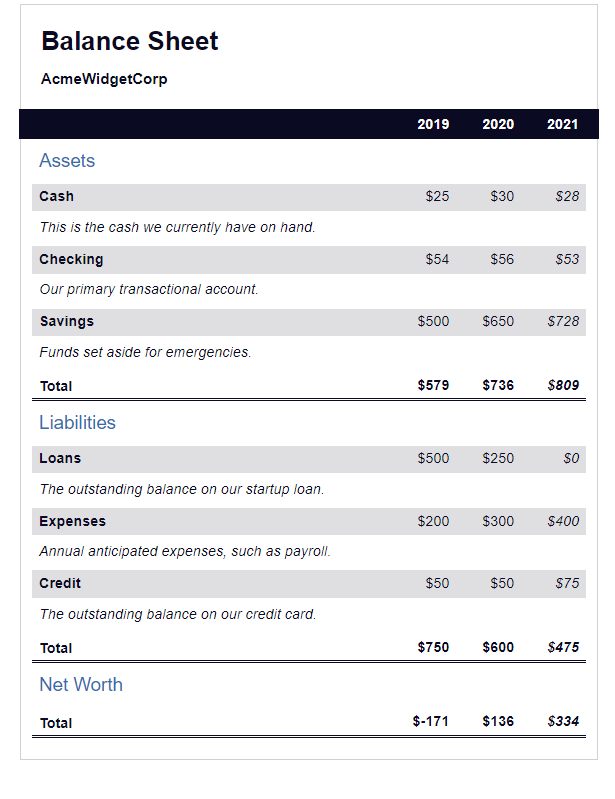

Onothe ```HTML/CSS``` exercise from [freeCodeCamp](https://www.freecodecamp.org/learn/2022/responsive-web-design/learn-more-about-css-pseudo-selectors-by-building-a-balance-sheet/step-1)<br>
### Balance Sheet
In this course, we build a balance sheet using pseudo selectors. We learned how to change the style of an element when you hover over it with your mouse, and trigger other events on your webpage.

