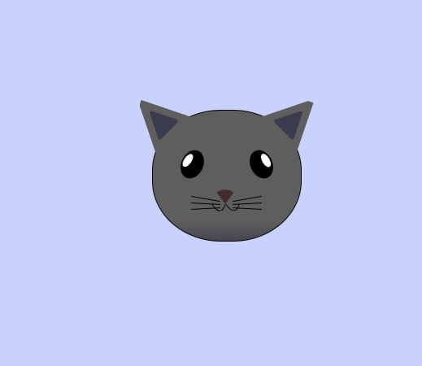

### More advance CSS
[freeCadeCamp](https://www.freecodecamp.org/learn/2022/responsive-web-design/learn-intermediate-css-by-building-a-cat-painting/step-1)  
In this course, we build a cat painting. We learned about how to work with absolute positioning, the z-index property, and the transform property.
___
