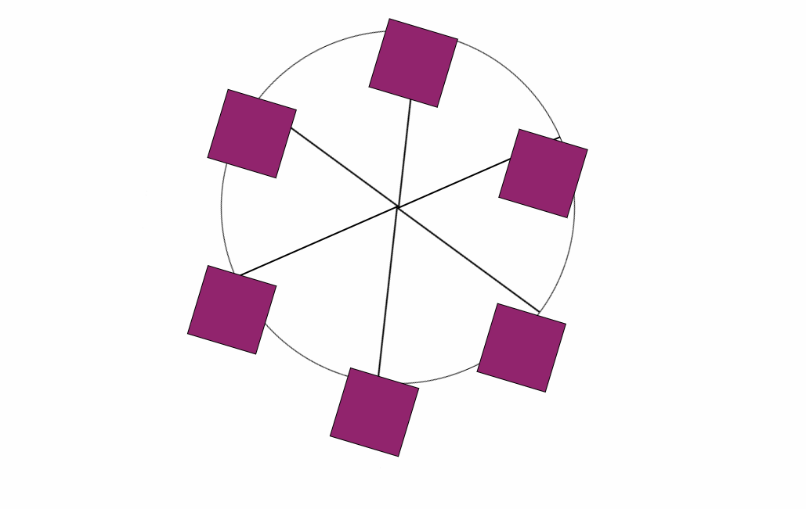

In this course from [freeCodeCamp](https://www.freecodecamp.org/learn/2022/responsive-web-design/learn-css-animation-by-building-a-ferris-wheel/step-1), we built a Ferris wheel. We learned how to use ```CSS``` to animate elements, transform them, and adjust their speed. <br>
You can use CSS animation to draw attention to specific sections of your webpage and make it more engaging.
___


* [LICEcap](https://www.cockos.com/licecap/) - simple animated screen capture tool
