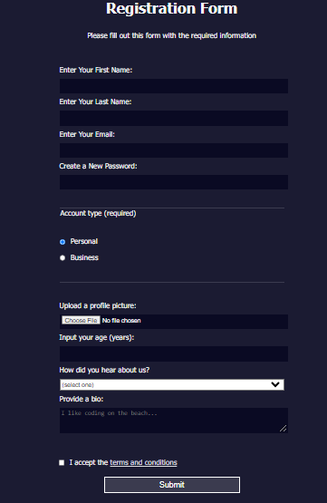

Here we have a simple *Form* example with pure ```HTML``` and ```CSS```<br>
Folowed [frecodecamp](https://www.freecodecamp.org/learn/2022/responsive-web-design/learn-html-forms-by-building-a-registration-form/step-1) tytorial.


### Version 1


----
### Version 2

