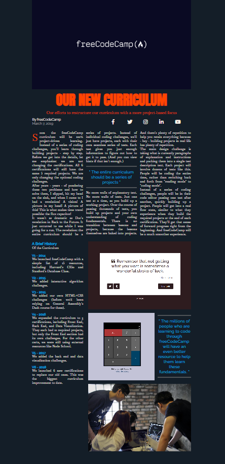

In this course from [freeCodeCamp](), we built a magazine article. We learned how to use ```CSS Grid```, including concepts like grid rows and grid columns.<br>
```CSS Grid``` gives you control over the rows and columns of your webpage design.
___
