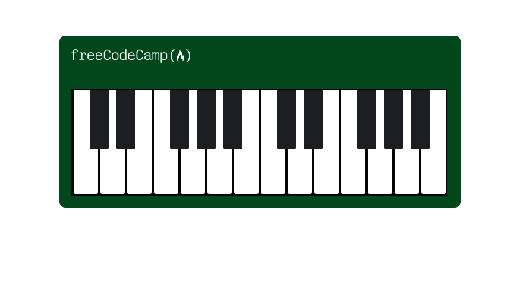

In this course at [freeCodeCamp](https://www.freecodecamp.org/learn/2022/responsive-web-design/learn-responsive-web-design-by-building-a-piano/step-1), we used ```CSS``` and ```Responsive Design``` to code a piano. We also learned more about media queries and pseudo selectors.
---
