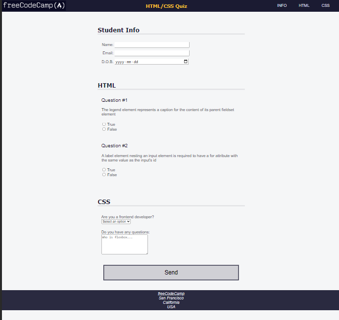

### Learn Accessibility by Building a Quiz
[freeCodeCamp](https://www.freecodecamp.org/learn/2022/responsive-web-design/learn-accessibility-by-building-a-quiz/step-1)<br>
Using basic ```HTML``` & ```CSS``` learn responsive web design and accessibility

