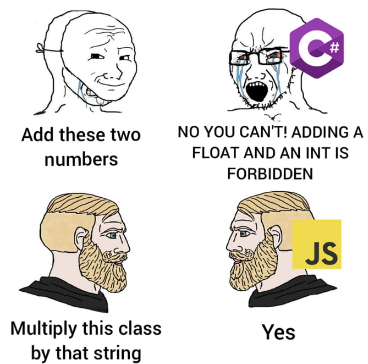
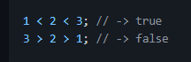
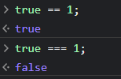
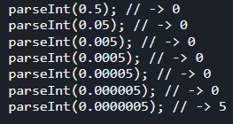
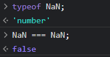
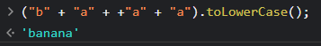
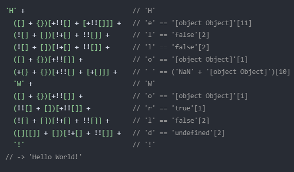
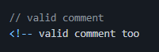

 # Distinct nature of JavaScript

Every programming language has its own quirks, advantages, and disadvantages. JavaScript, in particular, has gained a reputation for its peculiarities and unexpected behaviors. If you've been working in a single environment for a long time, you may not realize how strange certain tools or practices can appear to developers from other backgrounds



What makes programming languages intriguing is that they offer various approaches to solving problems, often with their own unique twists. While achieving the same results across different languages is possible, the journey to reach those outcomes can sometimes be quite unusual  and surprising. This diversity of approaches is what fuels innovation and allows developers to choose the language that best aligns with their specific needs and preferences. That's why it's considered good practice to familiarize yourself with other programming languages and become a "programming polyglot." Expanding your knowledge beyond a single language gives you a fresh perspective and opens your mind to different approaches. It allows you to tackle common tasks from different angles and broadens your understanding of programming concepts. Becoming a programming polyglot can enhance your problem-solving skills and make you a more versatile developer.
 In this article, we will explore some of the weird aspects of JavaScript that often leave developers scratching their heads.

Let us check some of those wild and weird examples:

### 1. Comparison of three numbers:

 

Huh? Let's break down each expression:

1.	```1 < 2 < 3;```
•	The comparison 1 < 2 evaluates to true.
•	In the second part of the expression, true is treated as the number 1.
•	Therefore, true < 3 is equivalent to 1 < 3, which evaluates to true.
2.	```3 > 2 > 1;```
•	The comparison 3 > 2 evaluates to true.
•	Similar to the previous example, true is treated as the number 1 in the next comparison.
•	Hence, true > 1 is equivalent to 1 > 1, which evaluates to false.

The unexpected behavior arises because JavaScript doesn't perform chained comparisons as we might intuitively expect. Instead, it evaluates each comparison independently and performs implicit type coercion.
To obtain the desired result, where all comparisons are evaluated correctly, we can use the greater than or equal (>=) operator:
```3 > 2 >= 1;```

### 2. The Equality Operator (==) and Strict Equality Operator (===) in JavaScript



The Equality Operator (==) performs type coercion, converting operands to a common type before comparison. In ```true == 1```, they are considered equal because both are truthy values.   
The Strict Equality Operator (===) does not perform type coercion. In ```true === 1```, they have different types, so it returns false.

Some other examples:
``` javascript
"5" == 5;    // true
"5" === 5;   // false
```
```javascript
"" == false;    // true
"" === false;   // false
```

It is generally recommended to use the Strict Equality Operator (===) to avoid unexpected behavior caused by type coercion.


### 3.The Mystery of ```parseInt()```:



The ```parseInt()``` function in JavaScript is used to convert strings to integers. However, when parsing decimal numbers with leading zeros, such as 0.05 or 0.0005, the function returns 0. This behavior is caused by how ```parseInt()``` converts decimal numbers to strings and removes leading zeros. However, if there is a non-zero digit after the decimal point, such as in "0.0000005," ```parseInt()``` will continue parsing and return the first non-zero digit.


### 4. Decimal Arithmetic Quirks:

```javascript
0.1 + 0.2 === 0.3; // -> false
0.5 + 0.1 === 0.6; // -> true
```
JavaScript's handling of floating-point numbers can lead to unexpected results. For example, when adding 0.2 and 0.1, instead of getting 0.3, you might end up with 0.30000000000000004 due to precision issues. Comparisons involving floating-point numbers should be done with a tolerance level to account for these discrepancies. 
You can read a much more detailed article over here [Understanding JavaScript’s Weird Decimal Calculations](https://medium.com/@DominicCarmel/understanding-javascripts-weird-decimal-calculations-e65f0e1adefb)

### 5. The NaN Conundrum:




Wait a second, Not a Number is a 'number'?

```NaN``` is a special value in JavaScript representing an undefined or indeterminate numeric value. Surprisingly, ```NaN``` is considered a numeric value itself. When comparing ```NaN``` to another ```NaN``` using the strict equality operator (===), the result is false. This is because ```NaN``` represents an undefined value and does not have a well-defined equality comparison.

### 6. Weird way to write a text:



Let's break it down step by step:

1. 'b' + 'a': 
The strings 'b' and 'a' are concatenated, resulting in the string 'ba'. 
2. +'a': 
The expression +'a' attempts to convert the string 'a' into a numeric value using the unary plus operator (+). 
Since 'a' cannot be converted to a number, it evaluates to NaN (Not-a-Number). 
3. 'ba' + NaN + 'a': 
When concatenating the string 'ba' with NaN, JavaScript coerces NaN into the string 'NaN'. 
The result of the concatenation becomes 'baNaNa'. 
4. ('baNaNa').toLowerCase(): 
The toLowerCase() method is called on the string 'baNaNa', converting it to lowercase. 
The final result is the string 'banana'. 

Here is another example with an explanation:



The code snippet demonstrates the creative use of JavaScript's operators and type conversions to extract characters and form the string 'Hello World!'. It showcases the flexibility and ingenuity of JavaScript programming, where unconventional approaches can yield intriguing results. 

Here is a really cool and fun tool that helps you [Write a sentence without using the Alphabet](https://bluewings.github.io/en/writing-a-sentence-without-using-the-alphabet/#weird-javascript-generator)

### Bonus:
### HTML Comments as JavaScript Comments:



In an interesting historical quirk, the `<!-- -->` syntax commonly used for HTML comments is also considered a valid comment in JavaScript. JavaScript treats it as a single-line comment, ignoring everything between the `<!--` and `-->` delimiters. While it is technically possible, using HTML comments within JavaScript code is generally discouraged as it can cause confusion and hinder code readability when separated from the HTML context.


---
JavaScript's quirks and surprises can both frustrate and amuse developers. By understanding and acknowledging these peculiarities, you can navigate through the language's idiosyncrasies more effectively. It's important to be aware of these quirks despite you may never meet them in real life. JavaScript's versatility and widespread use make it essential to grasp its nuances while staying updated with best practices. So, go ahead and embrace the weirdness of JavaScript—it's part of what makes programming an exciting and ever-evolving journey.
___

#### Aditional Resources:

For sure try this fun [quiz](https://jsisweird.com/), you'll be shown 25 quirky expressions and will have to guess the output. What is your score? Mine was embarrassing 11)

Much, much wider list of funny and tricky JavaScript examples here [What the f*ck JavaScript?](https://github.com/denysdovhan/wtfjs)

[Writing a sentence without using the Alphabet](https://bluewings.github.io/en/writing-a-sentence-without-using-the-alphabet/#weird-javascript-generator)

[Understanding JavaScript’s Weird Decimal Calculations](https://medium.com/@DominicCarmel/understanding-javascripts-weird-decimal-calculations-e65f0e1adefb)

[JavaScript is Weird](https://www.reddit.com/r/learnjavascript/comments/thuc7w/comment/i19vsmp/) - video with explanations.
